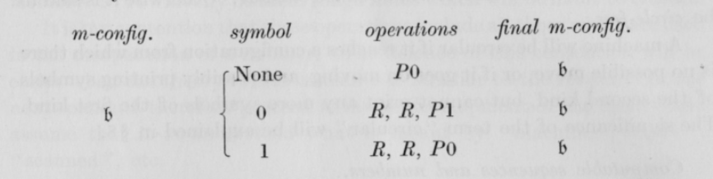

# Turing1936
Turing machines implemented directly from Turing's 1936 paper titled
*ON COMPUTABLE NUMBERS, WITH AN APPLICATION TO THE ENTSCHEIDUNGSPROBLEM*.

The intention is to provide an implementation that's as close to the original as possible, in order to make it easy to verify that they really are Turing machines and not second hand representations. Conventions specific to the implementation language are some times sacrificed for this obejctive.

His first example machine looks like this in the paper: 


It looks something like this in code:
```
  [
    (𝔟, (==none), [    _P0    ],  𝔟),
    (𝔟, (=='0' ), [_R, _R, _P1],  𝔟),
    (𝔟, (=='1' ), [_R, _R, _P0],  𝔟)
  ]

```

His second example looks like this in the paper: 


It looks something like this in code:
```
  [
    
    (𝔟, (\x -> True), [_Pә, _R, _Pә, _R, _P0, _R, _R, _P0, _L, _L  ], 𝔬),
    (𝔬, (=='1' ),     [             _R, _Px, _L, _L, _L            ], 𝔬),
    (𝔬, (=='0' ),     [                                            ], 𝔮),
    (𝔮, (`elem` "01"),[                    _R, _R                  ], 𝔮),
    (𝔮, (==none),     [                   _P1, _L                  ], 𝔭),
    (𝔭, (=='x'),      [                    _E, _R                  ], 𝔮),
    (𝔭, (=='ә'),      [                      _R                    ], 𝔣),
    (𝔭, (==none),     [                    _L, _L                  ], 𝔭),
    (𝔣, (/= none),    [                    _R, _R                  ], 𝔣),
    (𝔣, (==none),     [                   _P0,_L,_L                ], 𝔬)
  ]
```
